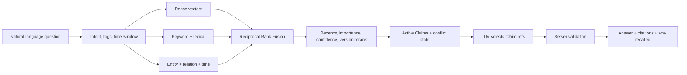
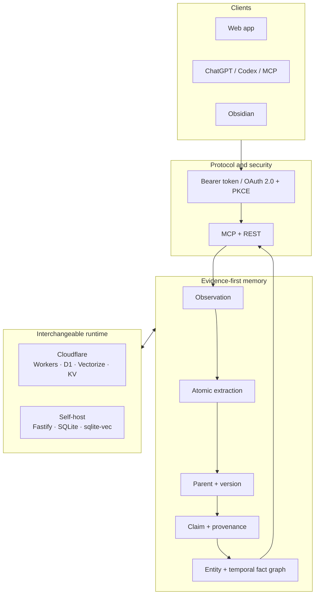

# Singularity


> A self-hosted, evidence-first memory engine for AI agents.

Singularity turns conversations, decisions, project updates, and notes into a memory layer that ChatGPT, Codex, other MCP clients, the web app, and Obsidian can share. It preserves original evidence, extracts traceable atomic claims, tracks how facts change, and generates answers whose citations are validated by the server.

[Live demo](https://agent.mtzs.cloud) · [Architecture](docs/ARCHITECTURE.md) · [90-second demo plan](docs/DEMO.md) · [Devpost story](docs/DEVPOST.md)

## Why this exists

AI assistants are useful inside a conversation and forgetful across conversations. Saving every transcript does not solve the problem: old claims conflict with new ones, semantically similar notes are not necessarily duplicates, and a retrieved paragraph is not automatically evidence for an answer.

Singularity treats memory as a versioned evidence system:

```text
raw observation → atomic claim → active version → hybrid recall → verified answer
```

The important boundary is between *finding something related* and *proving what the answer can say*.

## What it does

- **One memory layer for many clients.** MCP tools, OAuth-enabled ChatGPT connections, REST, the web app, and Obsidian use the same store.
- **Evidence-first capture.** Original observations remain available while the extraction pipeline creates atomic, source-linked claims.
- **Memory that can change safely.** Append, update, status, revision, conflict, and forget flows preserve lineage and activate one current parent version.
- **Hybrid recall.** Dense vectors, lexical matches, keywords, entities, relationships, and time signals are fused before reranking.
- **Claim-validated answers.** The model selects from a server-built Claim ledger; the server validates references, conflicts, answerability, language, and paragraph support before rendering citations.
- **Graph-assisted retrieval.** Entity and temporal facts influence recall. Associations expand navigation context but are not allowed to masquerade as factual evidence.
- **Two deployment targets.** Run on Cloudflare Workers with D1, Vectorize, KV, and Workers AI, or self-host with Node.js, Fastify, SQLite, and sqlite-vec.
- **Operational visibility.** Observatory shows memory health, extraction and classification queues, vector state, request traces, and model calls.
- **User-owned data.** The database and indexes live in infrastructure you control. If you configure a hosted model, the context sent to that provider is still subject to that provider's policies.

## How recall works



For candidate document \(d\), dense, keyword, and self-host lexical ranks are combined with Reciprocal Rank Fusion:

$$
S_{\mathrm{RRF}}(d)=
\sum_{r\in R_{\mathrm{dense}}}\frac{1}{k+r(d)}+
\sum_{r\in R_{\mathrm{keyword}}}\frac{w_d}{k+r(d)}+
\sum_{r\in R_{\mathrm{lexical}}}\frac{1}{k+r(d)}
$$

The fused score is then adjusted by bounded recency and frequency, importance, tag overlap, confidence, and active-version state. One of the time signals is:

$$
M_{\mathrm{time}}=e^{-\mathrm{age}/\mathrm{halfLife}}
$$

Tasks decay faster than durable procedures; frequent recall can compensate for age but cannot make an old entry outrank a fresh one solely through repetition. See [the architecture guide](docs/ARCHITECTURE.md) for the complete data and trust boundaries.

## Architecture



## Build Week: what changed

Singularity existed before OpenAI Build Week. The hackathon work is a meaningful extension, not a relabelled pre-existing project.

The comparison baseline is commit [`82e78ef`](https://github.com/cloudmantou/Singularity/commit/82e78ef29dfe3632d6a7f81366f27a6082ffd4a8), the last commit before the submission period began. From that baseline through [`798da71`](https://github.com/cloudmantou/Singularity/commit/798da715845e3675a5a9e36091f6405926c07fb8), the repository records **12 commits, 45 changed files, 6,118 insertions, and 384 deletions**.

The Build Week extension added or hardened:

- evidence/Claim projection consistency for capture, update, append, and forget;
- mutation recovery, idempotency, vector generation switching, and audit-chain restoration;
- query answerability, conflict-aware Claim selection, server-rendered citations, and entailment validation;
- cited natural-language recall answers and recent-activity synthesis;
- OpenAI-compatible structured-output handling and provider-specific fail-closed fallbacks;
- a broader unit, integration, UI-contract, and end-to-end verification surface.

### How Codex and GPT-5.6 contributed

Codex and GPT-5.6 were used as an implementation, review, and verification partner throughout the extension:

1. **Evidence mapping.** Codex traced capture, mutation, vector, graph, and recall paths before proposing changes.
2. **Test-first failure reproduction.** Regression tests were written for stale generations, missing provenance, unsupported answer text, invalid citations, conflict leakage, and restore-chain corruption before the corresponding fixes.
3. **Implementation.** Codex helped build narrow fixes across the memory projection and answer-validation boundaries.
4. **Adversarial review.** Separate review passes looked for fail-open behavior, secret leakage, retry amplification, historical-version confusion, and source/packaged/runtime mismatches.
5. **Real-system verification.** The final judgment remained evidence-based: typecheck, tests, coverage, audit, local runtime checks, and live browser traces were checked separately.

The human decisions were equally important: preserve raw evidence, make associations navigation-only, fail closed on unsupported factual answers, keep self-host data ownership explicit, and prefer incremental compatibility over replacing the existing architecture.

## Quick start

### Docker (recommended for self-hosting)

```bash
git clone https://github.com/cloudmantou/Singularity.git
cd Singularity
cp .env.example .env
# Set a high-entropy AUTH_TOKEN and your chat/embedding provider settings.
docker compose up -d --build
```

Open `http://127.0.0.1:8787`. Put an HTTPS reverse proxy in front before exposing the service publicly.

### Node.js 22

```bash
cp .env.example .env
npm install
npm run selfhost
```

### Cloudflare

```bash
npm install
npm run db:create
npm run db:migrate:remote
npm run vectors:create
npm run deploy
```

Configure Worker secrets and binding identifiers before deploying. The deployment script checks required Vectorize metadata indexes.

## Connect an AI client

```bash
claude mcp add --transport http singularity https://YOUR-DOMAIN/mcp
codex mcp add singularity --url https://YOUR-DOMAIN/mcp
```

The MCP surface includes:

```text
remember · append · update · set_status · recall · list_recent
relations · link · unlink · connections · forget
```

OAuth discovery and PKCE allow supported remote clients to register without placing the owner token in a connector URL.

## OpenAI support

The control plane includes presets for OpenAI chat and embedding models, including `gpt-4o-mini`, `gpt-4o`, `gpt-4.1-mini`, `text-embedding-3-small`, and `text-embedding-3-large`. The provider layer uses OpenAI-compatible Chat Completions and Embeddings contracts while isolating vendor-specific capability differences.

Singularity is provider-configurable: do not assume a deployment uses OpenAI unless its model settings show an OpenAI endpoint.

## Verification

```bash
npm test
npm run typecheck
npm run test:coverage
npm audit
```

Coverage gates are set to 80% for statements, lines, and functions. Tests are organized as unit, integration, UI-contract, and self-hosted MCP end-to-end suites.

For judges: the hosted instance is linked above. Access credentials and the required Codex `/feedback` session ID belong in the private Devpost testing instructions, not in this public repository.

## Project origin

Singularity began from [rahilp/second-brain-cloudflare](https://github.com/rahilp/second-brain-cloudflare), which established the Cloudflare Worker, MCP, vector-storage, and retrieval foundation. This repository has since evolved into an independent product line centered on evidence contracts, memory lifecycle, graph-assisted recall, self-hosting, observability, and verified answers.

## Roadmap

- Commit and ship incremental Recall streaming without weakening final Claim validation.
- Add a safe public demo workspace separate from the owner's private memory corpus.
- Build an interactive graph explorer on top of the existing entity and temporal fact backend.
- Add evaluation datasets for answerability, conflicts, historical queries, and cross-client recall.

## License

[MIT](LICENSE)
