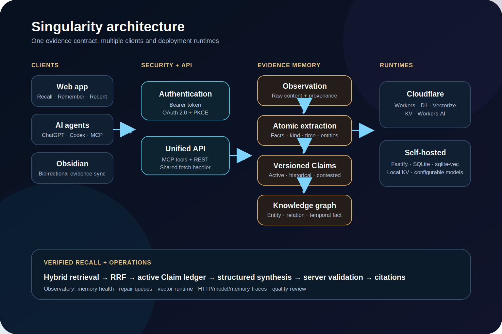
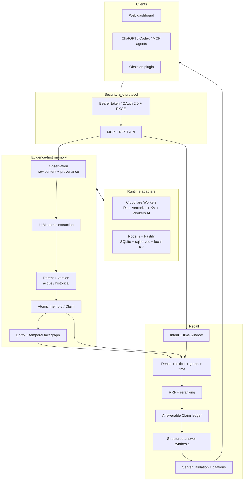
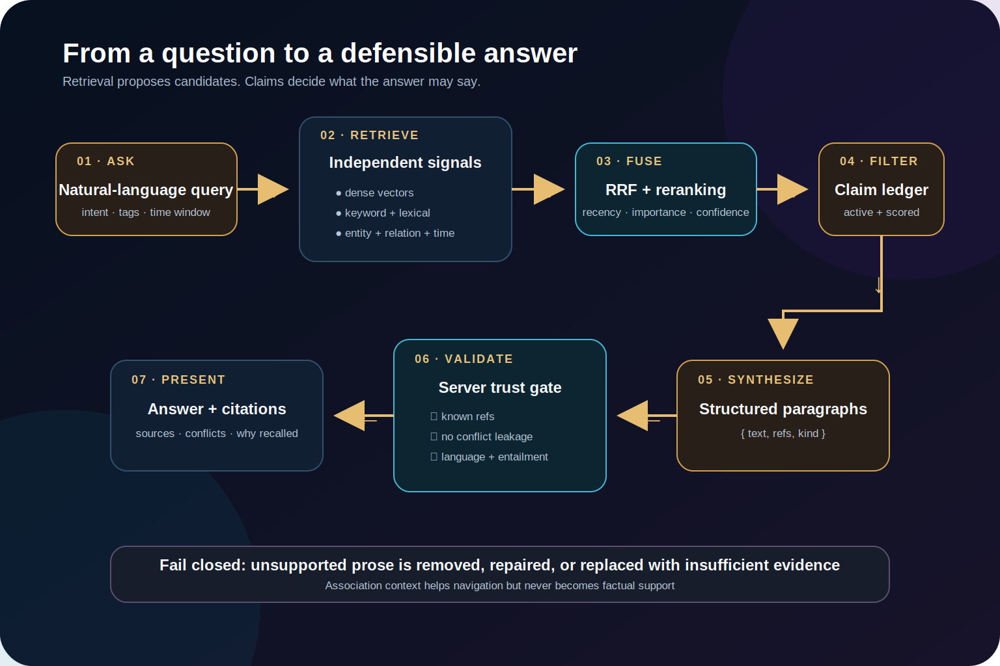
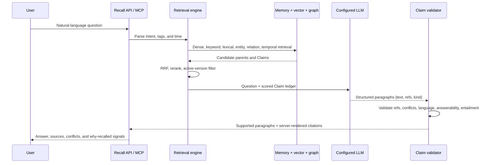

# Singularity technical architecture

This document explains how Singularity turns an input into evidence-linked memory and how it turns a question into a validated answer. It focuses on the boundaries that matter for correctness: raw evidence versus derived memory, current state versus history, retrieval versus factual support, and storage ownership versus model-provider processing.

## System map

## Capture pipeline

1. A web, REST, MCP, development-session, or Obsidian input becomes an **Observation** with source and revision metadata.
2. The extraction worker leases the Observation and asks the configured model for atomic facts.
3. Each fact becomes an atomic memory/Claim linked back to its Observation through a source record.
4. The system builds a new parent version. It activates that version only after every active Claim has provenance.
5. Entity resolution attaches people, projects, products, places, and concepts. Temporal facts and entity relations are stored separately from navigation-only associations.
6. Classification and Claim vector indexing run through retryable queues. Health endpoints expose due, deferred, exhausted, fallback, and partial-error states.

If extraction fails, a degraded fallback can keep the raw Observation usable while marking it for repair. It is never silently presented as a fully extracted version.

## Mutation and versioning model

An entry mutation is not one database update. It coordinates:

- the user-facing entry;
- Observation and source provenance;
- atomic Claim projection;
- parent-version activation;
- entry and Claim vectors;
- revision and compliance audit records.

Mutations use stable request hashes, leases, idempotency keys, explicit entry/knowledge commit phases, and a repair path. This prevents a retry from applying an append twice and lets operations distinguish a committed entry from a delayed vector index.

Only one parent version is active. Older versions remain queryable for historical time windows, but they cannot leak into a current-state answer through an orphaned vector.

## Recall pipeline

### Retrieval fusion

Let $r_i(d)$ be the rank of document $d$ in retrieval channel $i$. Singularity uses Reciprocal Rank Fusion instead of trying to compare raw cosine and keyword scores directly:

$$
S_{\mathrm{RRF}}(d)=
\sum_{r\in R_{\mathrm{dense}}}\frac{1}{k+r(d)}+
\sum_{r\in R_{\mathrm{keyword}}}\frac{w_d}{k+r(d)}+
\sum_{r\in R_{\mathrm{lexical}}}\frac{1}{k+r(d)}
$$

Keyword weight $w_d$ reflects the number of distinct query tokens matched. Entity, relation, and temporal signals add bounded boosts and can introduce a graph-only candidate when permitted.

### Reranking

The time signal is exponential:

$$
R_{\mathrm{time}}(d)=e^{-\mathrm{age}(d)/\mathrm{halfLife}(d)}
$$

Half-life depends on memory type: tasks are short-lived, procedures are durable, and work/context entries sit between them. Recall frequency can compensate for age, but the product is capped so repetition alone cannot overpower fresh evidence.

The final score is conceptually:

$$
S_{\mathrm{final}} = S_{\mathrm{RRF}}
\cdot M_{\mathrm{time+frequency}}
\cdot M_{\mathrm{importance}}
\cdot M_{\mathrm{tag}}
\cdot M_{\mathrm{confidence}}
\cdot M_{\mathrm{version}}
$$

### Answer validation

Retrieval results do not go straight into prose. The server builds a Claim ledger with immutable references such as `C1`, their verification state, conflicts, provenance, version, and query-answerability score. The model returns structured paragraphs that reference those Claims.

`ANSWERABILITY_MODE` controls how the query-answerability score affects output. `shadow` records warnings, `warn` exposes warnings, and `enforce` rejects paragraphs backed by a Claim that is not answerable for the query. Self-host deployments default to `shadow`; Cloudflare deployments default to `enforce` when the variable is unset. The checks below are therefore structural validations in every mode, with query-answerability rejection added only in `enforce` mode.

The server rejects or repairs output when it contains:

- missing or unknown Claim references;
- a factual paragraph backed only by a conflict or navigation association;
- a Claim that is active but not answerable for this query when `ANSWERABILITY_MODE=enforce`;
- unresolved conflict leakage;
- language mismatch;
- text not entailed by the cited Claims;
- malformed structured output or extra trailing content.

Citations are rendered after validation. The model does not get to invent the final citation mapping.

### Answer latency and verified caching

Recall reports retrieval, generation, repair, entailment-verification, total latency, model-call count, verifier usage, and cache-hit state as separate fields. A successful answer may be cached briefly, but only after Claim and citation validation completes. The cache key binds the authenticated principal and Vault, normalized question, retrieval policy, related-context snapshot, active Claim content and versions, conflict IDs, answerability policy, and generator/verifier model policy. Failed, partial, or unverified answers are never cached.

The cache is an optimization, not a knowledge source. A Claim version or conflict change produces a new key, and cache hits still emit the same ordered draft/final stream contract as a generated answer.

## Data and trust boundaries

| Boundary | Source of truth | What must not cross the boundary |
| --- | --- | --- |
| Observation → Claim | Original content, provenance, content hash | An extracted Claim without evidence |
| Historical → current | Active parent-version pointer | Stale vectors or old Claims in current recall |
| Association → evidence | Claim/source records | Navigation edges used as factual support |
| Retrieval → answer | Answerable Claim ledger | Related text treated as proof |
| Entry commit → vector index | Mutation state machine | Index delay reported as a rolled-back entry |
| Self-host storage → model API | User configuration | A claim of “fully offline” when a hosted model is configured |

## Deployment model

### Cloudflare

- Worker entry point and scheduled maintenance
- D1 for relational state and audit records
- Vectorize for entry and Claim embeddings
- Vectorize metadata-isolated entity ANN candidates, optionally in a dedicated namespace
- KV for OAuth state
- Workers AI or an OpenAI-compatible provider
- Static assets served by Workers Assets

### Self-hosted

- Fastify front door around the same Worker fetch handler
- SQLite adapters for D1 and KV behavior
- sqlite-vec plus lexical search for entry, Claim, and entity retrieval
- persistent database volume
- reverse proxy for public HTTPS

The shared fetch handler keeps protocol and memory behavior consistent; adapters isolate platform-specific storage.

Entity resolution always checks canonical names, aliases, and stable external IDs before ANN search. ANN results only create review candidates; they never silently merge identities. Entity merges synchronize the durable entity graph and the regenerable ANN projection, while stale sqlite-vec rows are removed before Top-K selection.

## Security and privacy posture

Current code includes:

- high-entropy owner-token configuration and connector URLs that do not carry credentials;
- OAuth 2.0 discovery and PKCE for supported remote MCP clients;
- a redirect allowlist, route-specific rate limits, bounded request bodies, and path traversal checks;
- masked settings responses and telemetry redaction before persistence;
- backup-integrity and audit-chain verification before restore.

Self-host request budgets separately limit model calls, maintenance, imports, and MCP traffic. The trusted owner credential receives an IP-plus-fingerprint bucket; unknown or invalid credentials share the IP-only bucket so rotating bogus tokens cannot bypass limits. Raw credentials are never stored in limiter keys. The production Docker profile runs as a non-root user with a read-only root filesystem, dropped capabilities, bounded resources, and an explicit health check.

Public documentation, demo media, and judge testing must use synthetic data. Never submit real personal-memory traces. Private testing instructions may contain only scoped access to an isolated synthetic deployment—never the owner's long-lived token.

## Operational model

The Observatory is part of the product, not a debugging afterthought. It exposes:

- Observation, atomic-memory, entity, and active-fact counts;
- extraction, classification, vector, and mutation queues;
- system and vector-runtime health;
- HTTP, model, and memory-event traces;
- quality-review queues for duplicates, entity merges, and conflicts.

The web Knowledge Review screen is the action surface for those queues. It keeps factual conflicts, entity identity proposals, and similar-memory decisions separate, requires explicit outcomes, and records accepted decisions through the existing compliance audit path.

AI review is an evidence-bound recommendation layer over those existing queues, never a fact-writing path. `shadow` records evaluations without an apply action; `suggest` always requires the authenticated owner to apply a recommendation; `auto_low_risk` is limited to exact-hash memory duplicates whose Scope, Vault, evidence root, source class, source time, observation time, Claim state, and Parent state all match. Conflicts and entity identity decisions remain human-gated. Jobs are leased and recoverable, model runs and application receipts are immutable, and application receipts commit in the same database batch as the underlying domain decision. Persisted manifests contain evidence hashes and internal references rather than raw memory text, so normal deletion does not leave a second immutable copy of the source content.

Reviewability is evaluated before a recommendation. Each immutable run records `sufficient`, `partial`, or `insufficient`, structured missing-context reason codes, and evidence-bound key differences. `partial` and `insufficient` runs must abstain and cannot be applied. The transient model snapshot includes bounded Claim, Parent, provenance, Scope, and temporal context; source identities and Evidence Root IDs are replaced with stable comparison fingerprints before the snapshot reaches the model. The durable manifest keeps only hashes, identifiers, statuses, source classes, and time metadata. The web review card therefore explains what differs and which context is missing without copying the underlying evidence into the AI ledger.

That visibility matters because a memory system can return HTTP 200 while its extraction, vector, or answer-synthesis layer is degraded.

## Key source locations

- `src/index.ts` — Worker, MCP/REST surface, capture, recall, classification, extraction
- `src/memory/` — evidence contract, mutations, versions, claims, graph, conflicts, backup
- `src/selfhost/` and `src/server.ts` — Node/Fastify runtime and Cloudflare-compatible adapters
- `src/providers/` — Workers AI and OpenAI-compatible chat/embedding providers
- `src/operations/` — health, queue, vector, and deployment checks
- `src/telemetry/` — redacted traces and analytics
- `public/` — bilingual web experience and Observatory
- `integrations/obsidian-plugin/` — Obsidian bridge
- `test/` — unit, integration, UI-contract, and self-host MCP E2E coverage
